# slide_template.md

**Design once. Then build, slide by slide.**

One hundred grayscale slide layouts plus one small design-system file. Paste both into Claude or Gemini and get 16:9 slides in your own colors and fonts. No code, no build step, no account beyond the AI you already use.

**Live site:** https://somatomita.github.io/slide-template-md/

[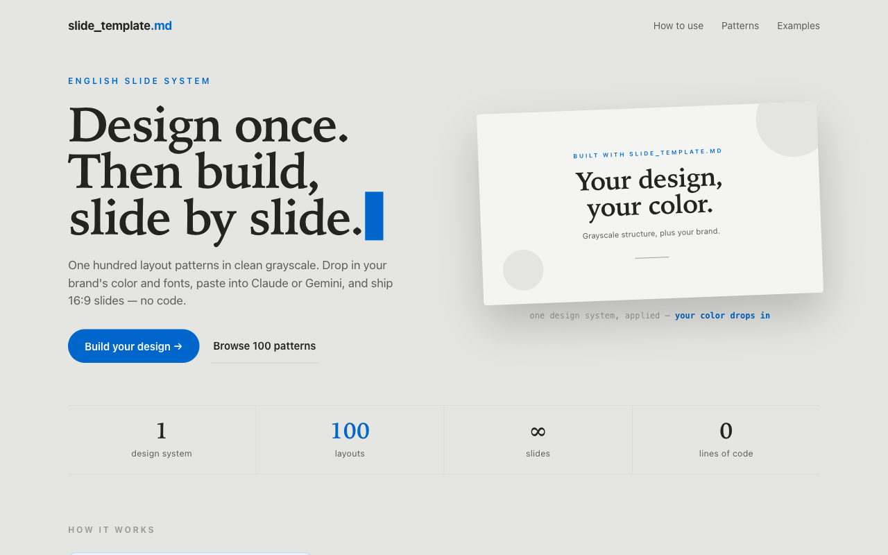](https://somatomita.github.io/slide-template-md/)

## How it works

You bring one file that describes your brand (`slide_template.md`: colors, fonts, spacing, logo rules). This site brings the layouts. The AI puts them together and returns a finished slide. Refine it one line at a time ("bring the title closer"), and only that line changes.

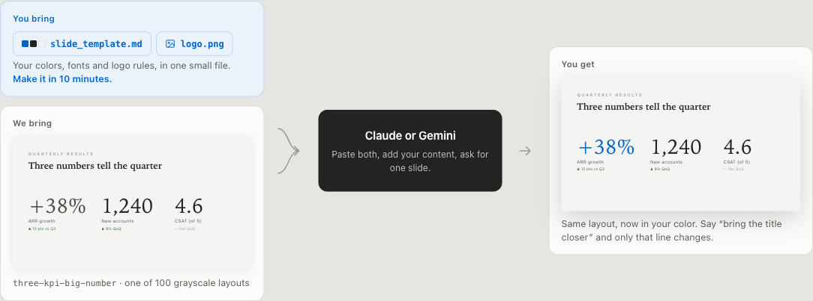

1. **Build your design system** once, from your logo and colors, a ready-made design, or a screenshot of your website. Copy-paste prompts are on the [How to use](https://somatomita.github.io/slide-template-md/how-to-use.html) page.
2. **Pick a layout** from the [pattern library](https://somatomita.github.io/slide-template-md/patterns.html), or hand the AI `ALL-PATTERNS.md` and let it choose per slide.
3. **Generate and refine** in any Claude or Gemini chat, a Claude Project, a Gemini Gem, or NotebookLM.
4. **Assemble a deck** with `SLIDE-DECK-shell.html`, then present it in the browser or print it to PDF.

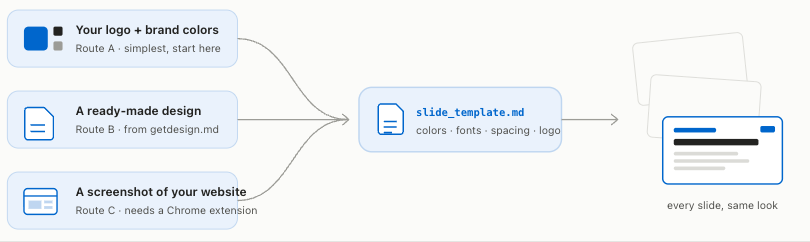

## A few of the 100 layouts

Every layout ships in grayscale. Your design system supplies the color. Same structure, your brand.

| | | |
|---|---|---|
| 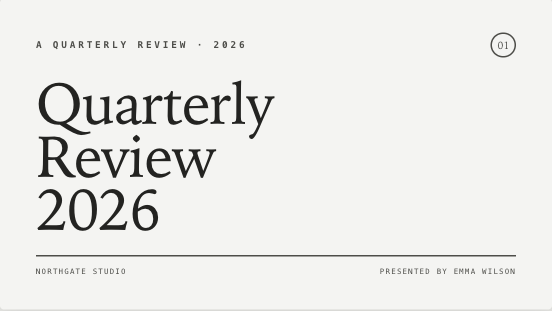 `editorial-cover-topbar` | 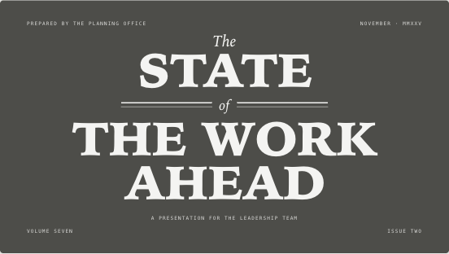 `masthead-cover-ornament` | 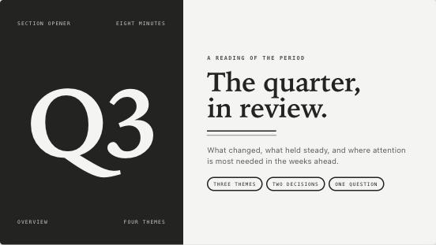 `editorial-numeral-opener` |
| 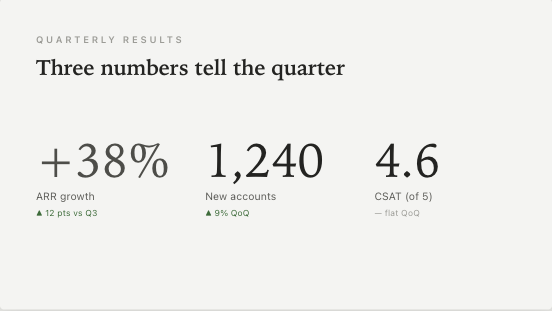 `three-kpi-big-number` | 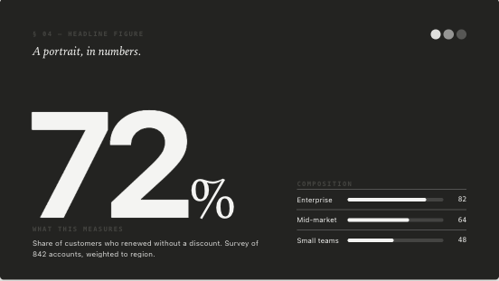 `editorial-big-figure` | 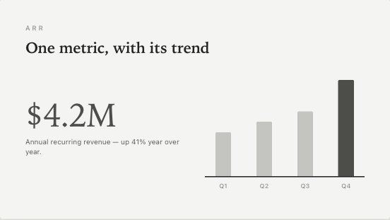 `kpi-bar-chart` |
| 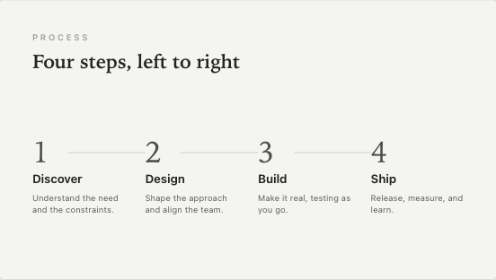 `four-step-flow` | 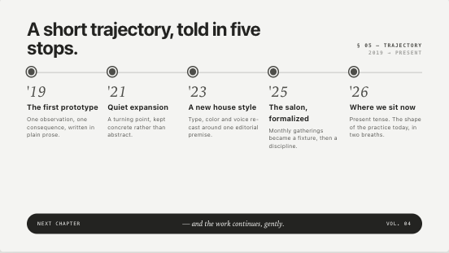 `trio-timeline-five-stops` | 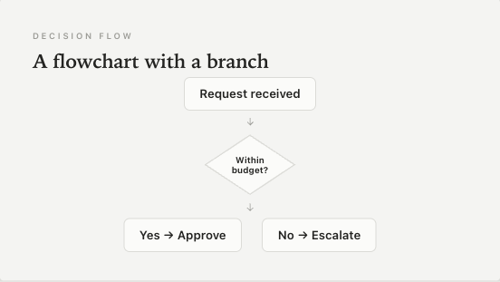 `flowchart-decision` |
| 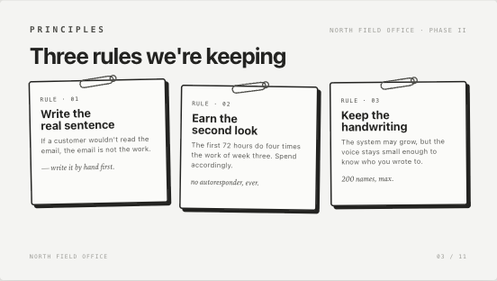 `pinned-notecards` | 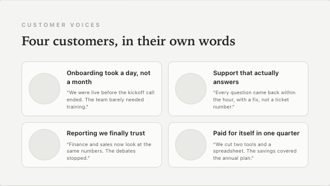 `testimonial-2x2-avatar` | 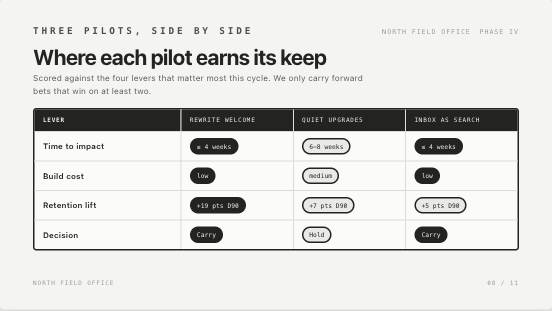 `notebook-comparison-ledger` |

The library covers covers and section dividers, agendas, content and quotes, flows and steps, diagrams, cards and grids, charts, tables, KPIs and summaries, FAQ, and profiles. Twenty of the layouts are an editorial set in the register of a literary quarterly, a fashion masthead, and a field notebook.

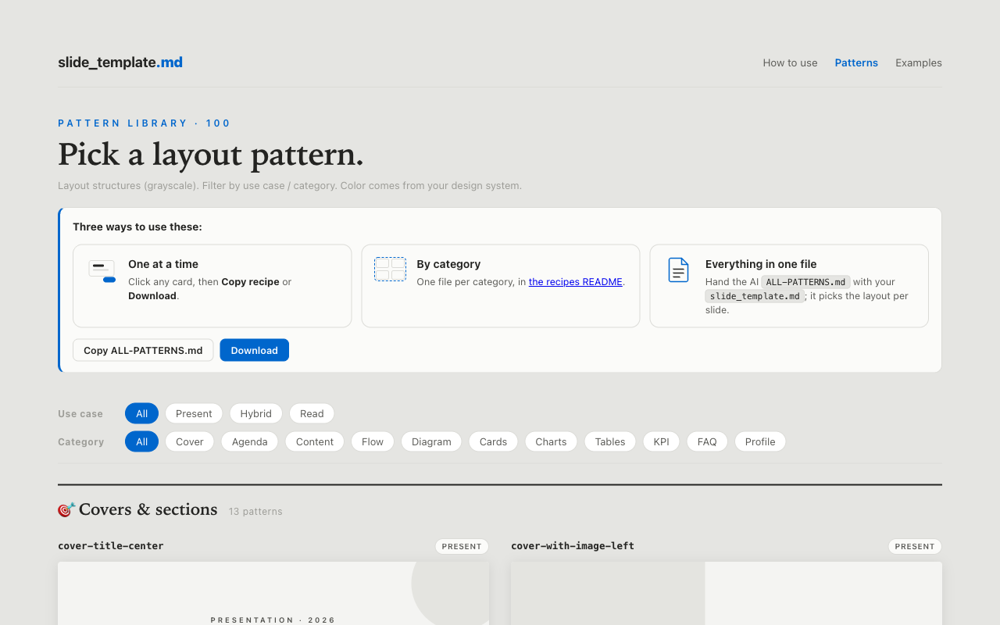

## Try a design system before you write one

The [Examples page](https://somatomita.github.io/slide-template-md/examples.html) is one live control over four complete decks. Start from a ready-made system or invent one, choose grayscale, a single accent, or two colors, then set the paper, the type pairing and whether the slides are talked over or read alone. Every slide on the page recolors as you go.

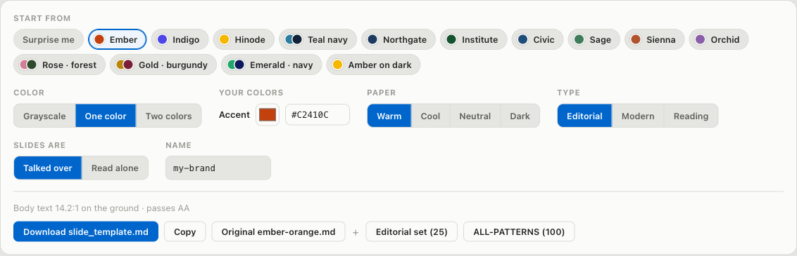

Download the `slide_template.md` that produced what you are looking at, and take the Editorial set of 25 layouts or all 100 with it. The four decks are a studio pitch, a numbers deck, a consulting report, and a long-form research report: the same patterns doing four different jobs.

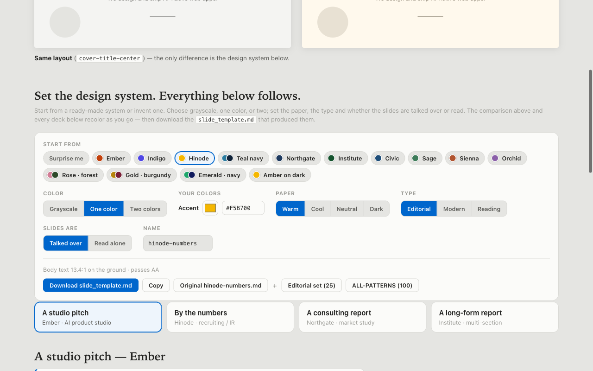

## Quick start

1. Open [How to use](https://somatomita.github.io/slide-template-md/how-to-use.html) and follow Route A: attach `slide_template.md`, `SLIDE-DESIGN-RULES.md`, and your logo, then paste the prompt. You get a filled-in `slide_template.md` for your brand.
2. Open [Patterns](https://somatomita.github.io/slide-template-md/patterns.html), click a layout, and use **Copy recipe**.
3. In the chat: attach your `slide_template.md`, paste the recipe and the "build one slide" prompt, and add your content. One slide comes back.
4. Repeat per slide, or upload `slide_template.md` and `ALL-PATTERNS.md` to a Claude Project or Gemini Gem once and just say "a slide on X".

Slides can be written in any major language. Change `<language>` in the prompt.

## What is in this repo

| Path | What it is |
|---|---|
| `index.html`, `how-to-use.html`, `patterns.html`, `examples.html` | The four pages of the site |
| `1-design-system/` | `slide_template.md` (the template), `SLIDE-DESIGN-RULES.md`, `CREATE-YOUR-DESIGN.md`, and ten sample systems in `examples/` |
| `2-patterns/` | Generated: one recipe per layout, per-category bundles, the curated `sets/editorial-set.md`, and `ALL-PATTERNS.md` |
| `3-build-a-deck/` | `BUILD-A-DECK.md`, `SLIDE-DECK-shell.html` (a print-ready deck the AI fills), `EXPORT-YOUR-DECK.md`, and four deck blueprints |
| `assets/` | CSS, JS (`colors.js` drives the live control), the social preview image, and the screenshots on this page |
| `tools/` | `genpat.py` (regenerates `2-patterns/`), `check_site.py` (quality gate), `og-template.html` |

Plain HTML, CSS, and a little JavaScript. No framework, no bundler, no web fonts, no external scripts. All links are relative, so the site runs from any base path.

## Run it locally

```bash
python3 -m http.server 8000
```

Open http://localhost:8000. Copy and Download buttons need http, so serve the folder rather than double-clicking the HTML.

## Deploy on GitHub Pages

Settings → Pages → Build and deployment → Source: "Deploy from a branch" → `main`, `/ (root)`. The site appears at `https://<user>.github.io/<repo>/`. `.nojekyll` is included so files are served as-is.

If you fork this, replace the absolute `og:url` / `og:image` URLs in the four HTML files with your own, and regenerate `assets/og.png` by screenshotting `tools/og-template.html` at 1200×630.

## Contributing a layout

`patterns.html` is the source of truth. Add a card there, then run:

```bash
python3 tools/genpat.py
python3 tools/check_site.py
```

CI runs the same two commands on every push and fails if `2-patterns/` is out of sync.

## License

[MIT](LICENSE) © 2026 Tamaishiki Co., Ltd. Reuse, modify, and redistribute freely; keep the copyright notice.
